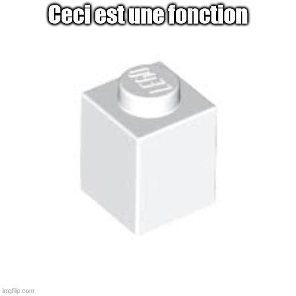

# Bienvenue au Dodjo !

<p align="center">
  
</p>

Le Dodjo est en quelque sorte le chemin que j'arpente dans l'univers de la programmation.
Le Dodjo est mon expérience personnelle mais pourrait aussi être une voie pour d'autres : je vous la partage donc. 

Pourquoi Dodjo ? Parce que Dodjo, c'est beau. Parce que Dodjo, c'est rigolo.

## Avertissements
Comme toute chose dans notre univers, ce contenu est **impermanent**. 
Je modifie ces notes de façon continue en fonction des retours des lectrices et des lecteurs.

## Les tests : ukemi du programmeur

### Brise-chute

Dans le contexte des arts martiaux, voici la définition de __ukemi__ d'après ma copine Wikipédia:
> Un ukemi est un brise-chute contrôlé qui sert à tomber sans se faire mal. 

<p align="center">
  
</p>


Alors qu'au judo, je pratique les ukemi depuis mon enfance; j'ai appris bien tardivement à employer les tests "contrôlés" en programmation.
  
Avant, je "testais" mon code en vérifiant "visuellement" que les résultats produits "convenaient". Ainsi quand je lançais mes scripts, trois cas se présentaient:
1. un message d'erreur apparaissait : je lisais le message, je tentais une correction, je relançais le script et je bouclais.
2. pas de message d'erreur et tout me semblait correct : je passais à la suite de mon travail.
3. pas de message d'erreur mais un résultat me chiffonnait: souvent je me disais "C'est bizarre, ça marchait tout à l'heure..." 

Dans le dernier cas, je m'arrachais quelques cheveux quand je m'apercevais que j'avais fait une "modif vite fait quelque part" dans le code qui s'avérait être la source à tous mes maux !!!

Par ailleurs, lorsque je reprenais du code de quelqu'un d'autre (en fait souvent une ancienne version de moi-même :scream:), j'avais **peur de tout casser** : de "faire du mal" au programme et à moi-même. Vous sentez l'analogie avec les ukemi arriver ?

Un des atouts du test contrôlé en programmation c'est de pouvoir se planter sans se faire mal.

Un exemple basique consiste à tester une fonction en comparant sa sortie avec ce que j'attends d'elle pour un jeu de paramètres donné.  Voici un exemple, pour ceux qui développent en Python:

Dans un fichier judo.py, j'écris la "coquille" de la fonction que je souhaite développer:
```python
def ippon_seoi_nage(attaquant:Judoka, défenseur:Judoka) -> Score:
    " Calcule le score marqué par le judoka attaquant"
    pass
```

Dans un autre fichier, le test:
```python
from judo import ippon_seoi_nage

def test_ippon_seoi_nage():
    # Je prépare les combatants
    attaquant = Judoka(grade="noire")
    defenseur = Judoka(grade="blanche")

    # Je calcule
    score = ippon_seoi_nage(attaquant:Judoka, defenseur:Judoka)

    # Je "contrôle" que le résultat est bien celui pour lequel j'implémente ma fonction
    assert score == Score("Ippon")
```

J'exécute le test (en général j'utilise ``pytest``). Et là ... bah ça foire! Mais c'est normal car la fonction ``ippon_seoi_nage`` n'a pas d'implémentation pour le moment !

Allez, on se relève et on reprend le combat ! A vous d'imaginer une implémentation qui fera **passer le test au vert** (c'est pas du green washing, enfin je ne crois pas...). 

Cette méthodologie, "coquille puis test puis implémentation", porte le nom de TDD pour *Test Driven Design*. Dans les faits, j'implémente souvent la fonction avant le test mais penser au test en amont permet de mieux clarifier ce que l'on attend d'elle.

Maintenant plus d'arrachage de cheveux (enfin presque...) ! Dès que je touche à du code, je relance mes tests. Cela permet de détecter immédiatement si une partie ne fonctionne plus **comme attendue**. 

### Intention et preuve de bonne foi

Aujourd'hui, lorsque je découvre ou que je revois du code, je commence par regarder les tests. En effet, les tests vont naturellement indiquer ce que les auteurs du code avaient l'intention de faire. De plus, si l'exécution des tests se déroulent sans erreur cela "prouve" que le programme "fonctionne".

<p align="center">
  
</p>

Donc aujourd'hui, je ne me repose plus sur la parole de celles ou ceux qui ont programmé et qui cherchent à me convaincre en disant "ça marchait sur ma machine", voire à faire les yeux du chat potté pour m'amadouer. Non, non, non!  Je lis et j'exécute les tests. Un point c'est tout. Un point c'est toi. (Zazie! Rends-moi le clavier !)

### Un premier pas sur le Chemin

Il y a bien sûr beaucoup plus de choses à dire à propos des tests. Mais j'ai commencé par ce qu'il y a de plus basique. J'aborderai peut-être plus tard d'autres aspects plus avancés si cela intéresse les lectrices et les lecteurs.

Malgré leur apparente simplicité, les tests ont énormément de vertus. Ils m'ont poussé à écrire du code "testable" et m'ont amené un peu plus vers la *Programmation Fonctionnelle*. Ils m'ont ouvert la voie à tout un panel de techniques sophistiquées, que je vais tenter de vous partager ensuite, qui permettent de mieux maîtriser son code toute en gardant la flexibilité de pouvoir le modifier sans peur de tout casser.

Faites donc vous aussi, ce premier pas sur la Voie. Hajime !

## Programmation Fonctionnelle

### Pourquoi utiliser des fonctions ? 

> "Pourquoi utiliser des fonctions ? Hein ? Pourquoi ?"

J'avais posé cette question un peu à l'improviste à mes collègues lors d'un coding dojo que j'animais.

Une réponse qui est venue est: "pour éviter de dupliquer du code!". Humm... Je ne m'attendais pas vraiment à cette réponse. En fait, je n'avais pas de réponse toute faite de mon côté non plus, mais l'argument de non-duplication ne me semblait pas très fondamental. J'ai alors répliqué:

> "Peut-être... Mais cela ne serait-il pas plutôt pour rendre le code plus modulaire ?!"

En effet, ce que l'on entend souvent par quelque chose de "modulaire" n'est-ce pas une chose dont on peut changer la structure en ajoutant ou en retirant des "modules", des "briques", des "composants" ?

On peut trouver toute sorte de choses modulaires autour de nous :
- des jouets Lego composés de briques (mes petits chouchous pédagogiques :smile:).
- des organismes vivants composés de cellules.
- des molécules composés d'atomes.
- des poèmes composés de mots.

On se rend compte que l'idée maîtresse qui transparaît de ces exemples est la notion puissante de **composition**.

Adopter une démarche de *Programmation Fonctionnelle*, c'est penser son code en terme de composition de fonctions. 

<p align="center">
  
</p>

Voici un exemple plutôt simple en Python:
```python
def split_phrase(phrase:str) -> list[str]:
  pass

def remove_long_words(words:list[str]) -> list[str]:
  pass

def remove_short_words(words:list[str]) -> list[str]:
  pass

def build_phrase(words:list[str]) -> str:
  pass

```

Je n'ai pas dénié préciser l'implémentation des fonctions car je veux attirer d'avantage votre attention sur leur *signature*. La signature c'est la description des interfaces d'entrée et de sortie d'une fonction. Ici, j'ai renseigné les *types* des entrées et sorties: une pratique ayant le nom de code *Type Hinting*. Malgré le fait que cela ne soit pas obligatoire en Python (contrairement à d'autres langages), cette pratique m'a fait faire un grand bond en avant dans la clareté du code que je produis. A tel point que je ne peux plus m'en passer : une sorte de *type addiction* :scream:. Nous reparlerons des types un peu plus loin.

J'espère que les noms des fonctions sont assez explicites. C'est d'ailleurs aussi une bonne pratique que j'essaye d'appliquer au quotidien: ne pas hésiter à prendre le temps de bien nommer ses fonctions car c'est le meilleur endroit pour la "documenter" (J'aimerais vous parler plus tard, dans la partie *Domain Driven Design*, de l'importance de la "dénomination"). 

Bon ! Très bien ! J'ai mes briques de base et après ? 

Faisons un premier essai en composant toutes ces fonctions:

```python
def modify_phrase(phrase:str) -> str:
  modified_phrase = build_phrase(remove_long_words(remove_short_words(split_phrase(phrase)))) 
  return modified_phrase
```

Pas long mais un peu lourd, non ? Il n'y a que 4 fonctions et ce n'est déjà plus très lisible... On remarque que l'ordre logique d'application des fonctions est dans le sens inverse de la lecture (F*ck le bon sens!). Et que faire si en plus je veux être flexible sur le fait d'utiliser ou non la fonction ``remove_short_words`` par exemple ??

Je préfèrerais un truc du style:

```python
phrase_example = "La composition c'est bien, la composition c'est bon"

# Cas avec les 4 fonctions
modify_phrase = composes_components([split_phrase,remove_short_words,remove_long_words,build_phrase])
phrase_without_short_and_long_words = modify_phrase(phrase=phrase_example)

# Cas avec seulement 3 fonctions
modify_phrase = composes_components([split_phrase,remove_long_words,build_phrase])
phrase_without_long_words = modify_phrase(phrase=phrase_example)


```

### C'est qui ce *Type* ? 


### Devenez la flèche 


Fonctions pures (exemple avec datetime.now ?)
Fonctions comme arguments de fonction


Théorie de la composition (catégorie) 


## Sujet à traiter:
- TDD
- Programmation Fonctionnelle
- Repository Pattern
- DDD
- Continuous Delivery
- Coding dojo
  
## Influences:
- Pierre-Emmanuel Bois (et la programmation asyncrhone)
- Jean-Baptiste Musso (et le Lean Software Manufacturing)
- Arjancodes (et les code smells)
- Dave Farley (et le continuous delivery)
- Martin Fowler (et l'agile)
- Bartoz Milewski (et la programmation fonctionnelle)

## Inspiration par-delà de la programmation:
- Richard Feynman (et la pédagogie du "take the world from another point of view") 
- Carlo Rovelli (et la gravité quantique à boucle)
- Olivia Caramello (et les ponts entre les domaines mathématiques)
- Alexandre Grothendieck (le grand refacteur des mathématiques)

## Références
https://github.com/BartoszMilewski/Publications/blob/master/TheDaoOfFP/DaoFP.pdf